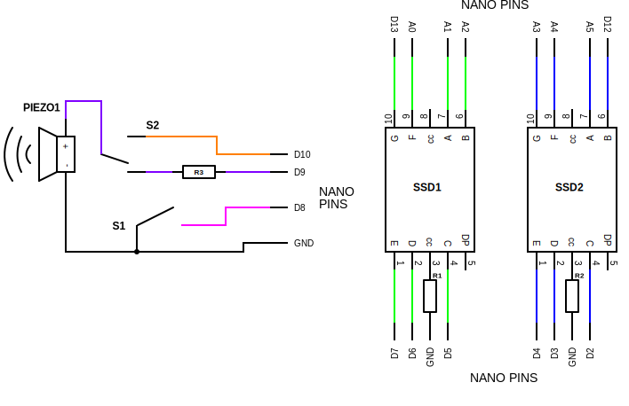

  
  <h1>Project Jackalope</h1>
  <h3><a href="3">Youtube Video</a></h3>

 

## Mission

Create a fake speed gun for my nephew. 

## Schematic & BOM

|Name          |Quantity|Component                  |
|:------------:|:------:|:-------------------------:|
|     NANO     |   1    |        Arduino Nano       |
|    PIEZO1    |   1    |           Piezo           |
|    R1, R2    |   2    |      220 Ω Resistor       |
|      R3      |   1    |      100 Ω Resistor       |
|      S1      |   1    |         Pushbutton        |
|      S2      |   1    |        Slideswitch        |
|  SSD1, SSD2  |   2    | Cathode 7 Segment Display |

## STL Files

[Click Here](./stl/)

## Component Buy Links

- [6 Colors Jumper Wire](https://amzn.to/48XHMGV)
- [20x Seven Segment Displays (Common Cathode)](https://amzn.to/494PFcY)
- [6x Colorful Mini Breadboards](https://amzn.to/48KzYYM)
- [3x Nano V3 ATmega328P](https://amzn.to/494mk2e)
- [4x 250g Sparkly Transparent PETG Filament](https://amzn.to/3vLVUUQ)
- [3x Nano Terminal Adapter V1.0](https://amzn.to/3OGnTMr)
